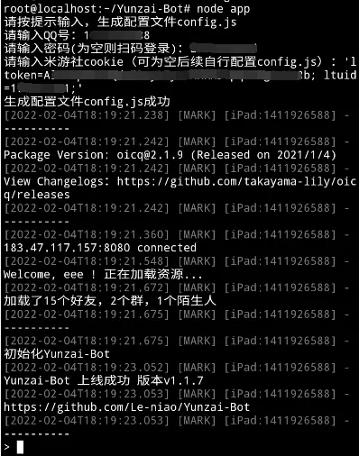

::: info

本教程基于 [Yunzai-Bot 安卓手机搭建教程](https://www.bilibili.com/read/cv15126105)
[原神 Q 群机器人安卓手机部署帮助](https://www.bilibili.com/read/cv17479494)

:::

::: warning
本教程基于 Debian，使用前请确保拥有一定的 Linux 基础，遇到问题请善用 Google/Bing/百度。
若对 Linux 了解程度不够，请尽量使用一个干净的系统部署。

:::

::: tip

所需配置

- 任意一台安卓 7.0 以上版本的安卓手机
- via 浏览器
- Termux (用于安卓 7.0 以上版本)
- 无需 root

:::

## 下载安装 Termux

[下载地址：](https://f-droid.org/packages/com.termux/)
滑到下方点击下载


## 安装环境

::: info
因为 Termux 官方支持安装纯原生安装 Linux 所以之前的方法作废直接采用官方方法安装
:::
### 1. Termux 换源

替换镜像源是为了之后安装软件更快，之前都是几十 KB 每秒，替换过后就是几 MB 每秒。
使用如下命令行替换官方源为 TUNA 镜像源：

只需在 $ 后输入以下四行命令 (在输入每行后按回车)

```bash
sed -i 's@^\(deb.*stable main\)$@#\1\ndeb https://mirrors.tuna.tsinghua.edu.cn/termux/termux-packages-24 stable main@' $PREFIX/etc/apt/sources.list
```

```bash
sed -i 's@^\(deb.*games stable\)$@#\1\ndeb https://mirrors.tuna.tsinghua.edu.cn/termux/game-packages-24 games stable@' $PREFIX/etc/apt/sources.list.d/game.list
```

```bash
sed -i 's@^\(deb.*science stable\)$@#\1\ndeb https://mirrors.tuna.tsinghua.edu.cn/termux/science-packages-24 science stable@' $PREFIX/etc/apt/sources.list.d/science.list
```

```bash
pkg update && pkg upgrade -y
```


### 3. 安装 Linux 环境

**上方的换源,安装基础操作做完就可以开始正式安装Linux了(本教程以debian为主)**

1. 安装基础组件proot-distro

```bash
pkg install proot-distro
```

对于该命令的解释:
    proot-distro 是一个用于在 Termux 中安装 Linux 发行版的工具。它使用 proot 作为后端，因此它不需要 root 权限。
    目前他支持以下Linux发行版

- Alpine Linux (edge)
- Arch Linux / Arch Linux 32 / Arch Linux ARM
- Debian (stable)
- Fedora 35
- Manjaro AArch64
- OpenSUSE (Tumbleweed)
- Ubuntu (22.04)
- Void Linux

2. 查看可安装Linux系统

```bash
proot-distro list
```


3. 安装Debian

输入:

```bash
proot-distro install debian
```

4. 安装完成后，进入 Linux(Debian)环境的指令为：

```bash
proot-distro login debian
```

出现root@localhost:~# 代表已进入Debian环境


在后面输入 exit 回车 即可退出Debian环境。


### 3. Debian 设置

进入debian后首先进行apt更新

``` bash
apt update&&apt upgrade -y
```


由于安装包管理器中的nodejs再通过n升级会导致报错，所以我们这里直接安装nodejs18（最新稳定版

``` bash
apt install -y apt-transport-https curl ca-certificates software-properties-common vim
curl -sL https://deb.nodesource.com/setup_18.x | bash
apt-get update && apt-get install -y nodejs
```

然后运行
`node -v`查看 node 版本


可以看到已经安装了18版本的nodejs

此外还可以安装n进行管理，经过上述步骤后使用n管理node版本则不会导致报错

安装n模块

```bash
npm install -g n
```


**Ps:** n 后面也可以跟随版本号（用于升级或降级）比如：  

```bash
n 16.13.0
```

升级完成再次运行

```bash
node -v
```

查看node版本
注意：修改完成如果`node -v`没变的话
退出重启一下Termux重新运行

```bash
proot-distro login debian
```

进入 Debian

首先安装git、Chromium及其依赖以及中文字体

```bash
apt-get install -y chromium chromium-driver chromium-l10n
apt-get install -y --force-yes --no-install-recommends fonts-wqy-microhei
apt-get install -y git
```

安装并运行 redis

```bash
apt -y install redis && redis-server --daemonize yes
```

克隆项目

```bash
git clone --depth=1 -b main https://gitee.com/Le-niao/Yunzai-Bot.git

```

安装模块

```bash
cd Yunzai-Bot
```

安装 pnpm

```bash
npm install pnpm -g
```

安装依赖

```bash
pnpm install -P
```

此时运行的话，一部分用户在拉取帮助的时候会出现Chromium报错导致无法生成图片，所以我们要手动指定Chromium的位置

编辑文件./config/config/bot.yaml
```bash
vim ./config/config/bot.yaml
```
此时会进入编辑界面，按“i”进入编辑模式


在chromium_path：下面一行添加/usr/bin/chromium
然后按ESC，输入:wq并回车保存并退出


以上，机器人所有基本工作就都已经完成了，然后我们可以使用以下命令开始运行了
```bash
node app
```

按提示输入qq号，密码，cookie

首次登录要过滑块验证，可以用滑块验证助手 <https://maupdate.rainchan.win/txcaptcha.apk>

打开验证助手输入验证链接，手动过了滑块验证后，获得tickek

复制获得的tickek然后粘贴回车，最后再过密保登录



## 再次运行需要先打开Debian

```bash
proot-distro login debian
```

开启redis

```bash
redis-server --daemonize yes
```

然后运行

```bash
cd Yunzai-Bot
node app
```
