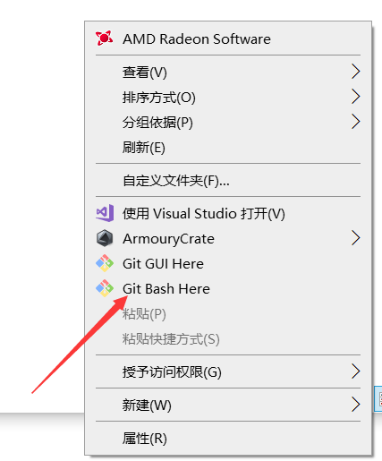
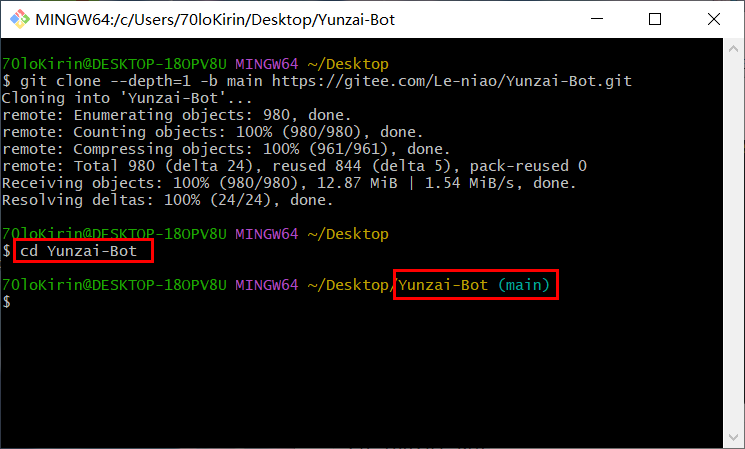
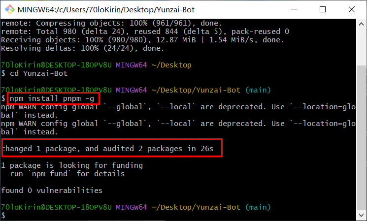
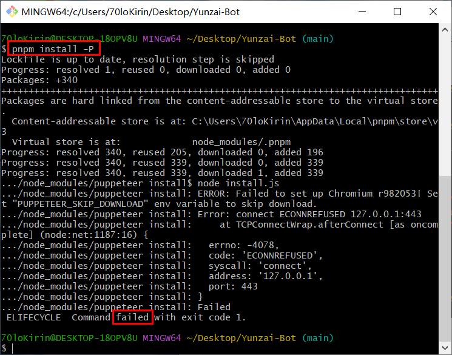
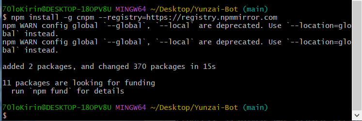
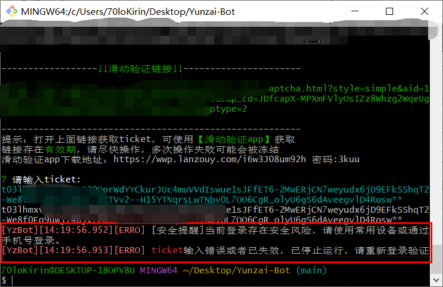
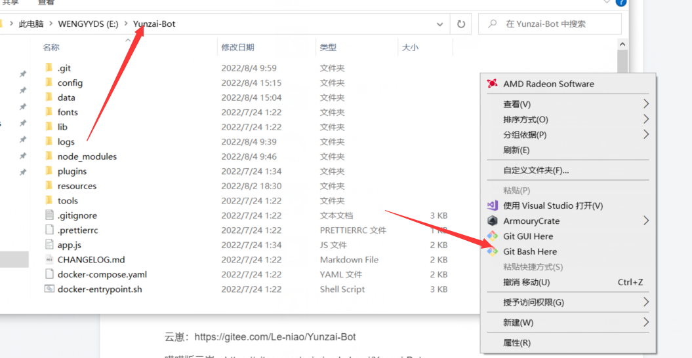

参考 [本地 Windows 系统下安装 Yunzai-Bot](https://github.com/kirigirisan/Windows-Install-Yunzai-Bot)。

::: tip

**WARN**只是警告可以不管 **ERROR**和**failed**才是出了问题

:::

# **安装 Yunzai-Bot**

## **一、安装 nodejs**

版本必须在 14 及以上，[点我下载](http://nodejs.cn/download )  一路 next 安装


------

## **二、安装启动 redis**

下载地址： <https://wwa.lanzoui.com/inuUQi6v3ad>

解压后双击`redis-server.exe`，成功运行后**窗口别关**，保持运行就行

::: details 双击运行直接闪退

> **请先打开文件扩展名！！！！！！！！！！！！！**
>
> **！！！！！！！！！！！！！！！！！！！！！！**
>
> 方法如下：<https://jingyan.baidu.com/article/22a299b53ff3b7df18376a1f.html>

然后在 Redis 目录下建一个名称是 start.txt 文本，在新建的 start.txt 文件中加入下面一句话

`redis-server.exe redis.windows.conf`

接着将文件名`start.txt`格式改成`start.bat`就行了

双击打开 start.bat 就可以了

此方法摘自教程评论区

:::

------

## **三、克隆代码并运行**

### 安装 git

 下载地址： <https://wwp.lanzoub.com/iK0VE094y7uf>

- 密码:klee
- 选择你要安装的目录，空白处右键，Git Bash Here

​                 

### 克隆代码

**请确保输出与图中相似且没有报错 error 再进行下一步**

```
git clone --depth=1 -b main https://gitee.com/Le-niao/Yunzai-Bot.git
```


### 进入云崽根目录

```
cd Yunzai-Bot
```



### 安装 pnpm

```
npm install pnpm -g
```



### 安装依赖

```
pnpm install -P
```

::: details 报错 ELIFECYCLE  Command failed with exit code 1.

> 报错：`ELIFECYCLE  Command failed with exit code 1.`
>
> 
>
> 解决办法：使用 cnpm 安装
>
> 先安装 cnpm
>
> ```
> npm install -g cnpm --registry=https://registry.npmmirror.com
> ```
>
> 
>
> ```
> cnpm install
> ```
>
> 

:::

### 启动云崽

```
node app
```


:::details 登陆遇到问题

扫码登陆最快但要求在同一网络环境，并且容易掉线

账号密码登陆需抓取 ticket，乐佬有给 app，操作也不是很复杂

登陆端口**不选**安卓手机，这样的话方便自己用手机上号检查情况

- 1、**如何在网页端获取 ticket**

乐佬给了一个好用的 app，我这里就只进行简单的文字描述了

>打开该网站，按下 f12
>
>点击**network**（中文是**网络**），如果没有就点击旁边的 **>>>**
>
>然后完成滑块
>
>点击右边的文件，然后点击**preview**（中文是**预览**）
>
>复制 ticket 冒号后**引号里的**全部内容粘贴到原来的 git 窗口
>
>然后回车

若要登陆保护验证，按照步骤走就行

- 2、**[安全提醒] 当前登录存在安全风险，请使用常用设备或通过手机号登录。**



**若出现如图问题，则只能扫码登陆**

:::

------

### 如何再次开启机器人

1、打开 redis

2、在云崽路径下 git bash here



3、运行

```
node app
```

---

## 四、插件安装

**所有指令都在云崽根目录下运行**

插件安装完成之后需重启才会生效

### [喵喵插件](https://gitee.com/yoimiya-kokomi/miao-plugin)

**有面板查询功能**

**非常好用，必装**

```
git clone https://gitee.com/yoimiya-kokomi/miao-plugin.git ./plugins/miao-plugin/
```

安装依赖指令二选一（pnpm 失败了就用 cnpm，安装 pnpm 和 cnpm 的指令在上面）

::: code-tabs#shell

@tab pnpm

```
pnpm add image-size -w
```

@tab cnpm

```
cnpm install image-size --save
```

:::

发送`#喵喵帮助`和`#喵喵设置`可以查看相关功能

::: details 喵喵插件进阶配置

**#喵喵帮助**可以编辑，使用以下网站

<https://miao.seutools.com/> （虽然写着功能无法使用但其实是可以使用的）

选择**使用默认配置**

配置完之后下载**help-list.js**和**icon.png**两个文件

放入 Yunzai-Bot\plugins\miao-plugin\resources\help\文件夹下

选择替换目标文件

> 若想替换掉背景，使用**同名文件**替换掉
>
> 在 Yunzai-Bot\plugins\miao-plugin\resources\common\theme\文件夹的两个文件
>
> (一个是 bg-01.jpg 一个是 main-01.png**后缀名**也要和原来保持一致)
>
> 若只想用一张图片当做背景图，删掉 main-01.png 即可
>
> 可以在#**喵喵设置**里面修改渲染精度≈调整图片大小

可以#**喵喵设置帮助开启**将喵喵设置设置为默认帮助 

更多可修改的内容比如颜色字体不透明度在 index.css 文件里，可自行探索

示例：


:::

### [逍遥插件](https://gitee.com/Ctrlcvs/xiaoyao-cvs-plugin)

有体力背景图，好用

```
git clone https://gitee.com/Ctrlcvs/xiaoyao-cvs-plugin.git ./plugins/xiaoyao-cvs-plugin/
```

安装依赖指令二选一（pnpm 失败了就用 cnpm，安装 pnpm 和 cnpm 的指令在上面）

::: code-tabs#shell

@tab pnpm

```
依次运行
pnpm add superagent -w
pnpm add promise-retry -w
```

@tab cnpm

```
依次运行
cnpm install superagent --save
cnpm install promise-retry --save
```

:::

发送#**图鉴设置**  查看设置

- 依次发送

**#图鉴更新   #图鉴设置体力开启**

- 如果想戳一戳返回体力背景图，请依次发送（v3 暂未拥有戳一戳功能 2022.8.24）

**#喵喵设置戳一戳关闭     #图鉴设置戳一戳开启**

### 其他插件

- 有一个文件夹的那种插件放在Yunzai-Bot/plugins目录下

- 只有一个以js为后缀的那种插件Yunzai-Bot/plugins/example目录下

**自行按需选择：**

闲心插件（v3） ：<https://gitee.com/xianxincoder/xianxin-plugin>

卡池自定义（v3） ：<https://gitee.com/Nwflower/flower-plugin>

小雪插件（v3） ：<https://gitee.com/XueWerY/xiaoxue-plugin>

碎月 plugin（v3）：<https://gitee.com/Acceleratorsky/suiyue>

宵鸟（python）插件（v2&v3）：<https://gitee.com/realhuhu/py-plugin>

谁是卧底（v3）：<https://gitee.com/Saury-loser/Saury>

插件索引：<https://gitee.com/Hikari666/Yunzai-Bot-plugins-index>

[私货](https://github.com/70loKirin/ATRI-plugin)
